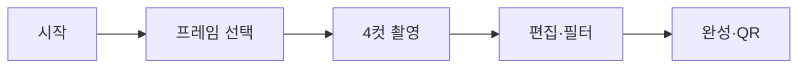
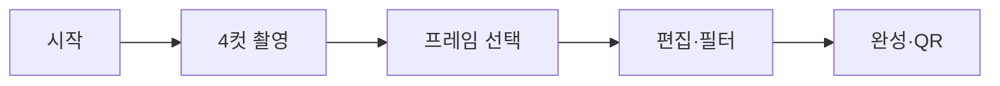
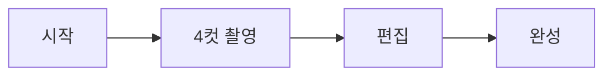

# Event Photobooth

행사마다 **`public/config/event.json`** 과 **프레임 테마 JSON** 만 바꿔 배포하는 인생네컷(4컷) 포토부스 키오스크 템플릿입니다.

태블릿·노트북·키오스크에서 촬영 → 프레임 합성 → Supabase 업로드·QR 공유·로컬 갤러리까지 운영할 수 있습니다.

> 저장소: [github.com/kim-kwanho/christmas_blessing](https://github.com/kim-kwanho/christmas_blessing)  
> (권장 이름: `event-photobooth`)

---

## 목차

- [촬영 플로우](#촬영-플로우)
- [빠른 시작](#빠른-시작)
- [환경 변수](#환경-변수)
- [행사 설정 (`event.json`)](#행사-설정-eventjson)
- [기능 플래그](#기능-플래그)
- [테마·프레임](#테마프레임)
- [Supabase 설정](#supabase-설정)
- [Admin · 프레임 디자이너](#admin--프레임-디자이너)
- [배포](#배포)
- [프로젝트 구조](#프로젝트-구조)
- [스크립트](#스크립트)
- [문제 해결](#문제-해결)

---

## 촬영 플로우

`flow.frameFirst` 와 `features.frameSelect` 조합에 따라 화면 순서가 달라집니다.

**프레임 먼저** (`frameFirst: true`, 현재 평안다락방 설정)



**촬영 먼저** (`frameFirst: false`)



**프레임 고정** (`frameSelect: false`)



| URL | 설명 |
|-----|------|
| `/` | 시작(랜딩) 화면 |
| `/app` | 포토부스 본체 |
| `/admin` | 관리자 (PIN) |
| `/admin/frames` | 프레임 디자이너 |
| `/result/:id` | QR로 열리는 결과물 페이지 |

---

## 빠른 시작

### 요구 사항

- Node.js **18+**
- npm
- (QR·클라우드 저장) [Supabase](https://supabase.com) 프로젝트

### 설치·실행

```bash
git clone https://github.com/kim-kwanho/christmas_blessing.git
cd christmas_blessing
npm install
cp .env.example .env
```

`.env` 에 Supabase URL·anon key·Admin PIN 을 입력한 뒤:

```bash
npm run dev:all
```

| 주소 | 용도 |
|------|------|
| http://localhost:8000 | 시작 화면 |
| http://localhost:8000/app | 포토부스 |
| http://localhost:8000/admin | 관리자 |
| http://localhost:3001/api | 업로드 API (QR용) |

상세 배포 절차는 [docs/SETUP.md](docs/SETUP.md) 를 참고하세요.

---

## 환경 변수

`.env` 파일 (커밋 금지). 템플릿은 [.env.example](.env.example).

| 변수 | 필수 | 설명 |
|------|------|------|
| `VITE_SUPABASE_URL` | QR·업로드 시 | Supabase 프로젝트 URL |
| `VITE_SUPABASE_ANON_KEY` | QR·업로드 시 | Supabase anon public key |
| `VITE_ADMIN_PIN` | 권장 | `/admin` 접근 PIN. 비우면 PIN 없이 접근 |
| `VITE_API_BASE_URL` | 선택 | API 베이스 (기본 `/api`, Vite가 3001로 프록시) |
| `VITE_APP_URL` | 선택 | QR 링크용 공개 URL. 비우면 `window.location.origin` 사용 |

---

## 행사 설정 (`event.json`)

경로: **`public/config/event.json`** — 행사마다 가장 자주 수정하는 파일입니다.

### 전체 스키마 예시 (현재 평안다락방)

```json
{
  "event": {
    "id": "peace-attic-summer-2025",
    "name": "인생네컷",
    "tagline": "허브대학부 평안다락방 · 여름 아웃리치",
    "locale": "ko"
  },
  "branding": {
    "startBackground": "",
    "primaryColor": "#0284C7",
    "accentColor": "#FBBF24",
    "fontFamily": "Inter, sans-serif"
  },
  "routes": {
    "landing": "/",
    "app": "/app",
    "admin": "/admin"
  },
  "flow": {
    "frameFirst": true
  },
  "features": {
    "frameSelect": true,
    "photoDrag": true,
    "gallery": true,
    "qrShare": true,
    "admin": true,
    "print": false,
    "kioskMode": true,
    "filters": true
  },
  "camera": {
    "photoCount": 4,
    "countdownSeconds": 6,
    "quality": 0.9
  },
  "output": {
    "width": 1200,
    "height": 1600
  },
  "storage": {
    "dbNamePrefix": "photobooth"
  },
  "theme": {
    "id": "peace-attic-summer",
    "framesPath": "/themes/peace-attic-summer/frames.json",
    "framesStorage": "local",
    "defaultFrameId": 1
  },
  "kiosk": {
    "idleSeconds": 60,
    "fullscreen": true
  }
}
```

### 섹션별 설명

| 섹션 | 역할 |
|------|------|
| `event` | 행사 ID·이름·한 줄 소개 (`name`은 시작 화면·헤더에 표시) |
| `branding` | `startBackground` 이미지 경로, 포인트 색, 폰트 |
| `routes` | 랜딩·앱·admin 경로 (기본값 유지 권장) |
| `flow` | `frameFirst`: 프레임을 촬영보다 먼저 선택할지 |
| `features` | 기능 on/off — [기능 플래그](#기능-플래그) 참고 |
| `camera` | 촬영 장수, 카운트다운(초), JPEG 품질 |
| `output` | 최종 합성 이미지 픽셀 크기 |
| `storage` | IndexedDB 이름 접두사 (`dbNamePrefix`) |
| `theme` | 프레임 테마 경로·기본 프레임·저장소 |
| `kiosk` | 유휴 시간(초) 후 시작 화면 복귀, 전체화면 시도 |

### `theme.framesStorage`

| 값 | 동작 |
|----|------|
| `local` (기본) | `public/themes/.../frames.json` 정적 파일 사용 |
| `supabase` | `themes` 버킷의 `{theme.id}/frames.json` 로드 (Admin에서 저장 후 사용) |

---

## 기능 플래그

| 플래그 | 설명 |
|--------|------|
| `frameSelect` | 프레임 선택 단계 표시. `false`면 `defaultFrameId`만 사용 |
| `photoDrag` | 편집 화면에서 사진 위치 드래그 |
| `filters` | 편집 화면 필터 (원본·밝게·선명·흑백) |
| `gallery` | 사이드 메뉴 로컬 갤러리 (IndexedDB) |
| `qrShare` | Supabase 업로드 + QR 코드 생성 |
| `admin` | `/admin` 관리 페이지 |
| `kioskMode` | 유휴 오버레이·키오스크 UX |
| `print` | Admin 인쇄 (로컬 `server.js` + 프린터 필요) |

---

## 테마·프레임

### 디렉터리

```
public/themes/
  peace-attic-summer/frames.json   # 현재 행사 테마 (6종)
  christmas/frames.json            # 크리스마스 예시
  default/frames.json                # 최소 예시
```

### 현재 테마 `peace-attic-summer` 프레임

| ID | 이름 | 특징 |
|----|------|------|
| 1 | Hope | 네이비 테두리, 하단 Hope 로고 (`logoStyle`) |
| 2 | Summer Sky | 하늘색 하단 그라데이션 + 물결 |
| 3 | Passport | 여권 스탬프·MRZ·VISA 마크 (`bottomStyle: "passport"`) |
| 4 | Sunset | 노을 그라데이션 + 별 패턴 |
| 5 | Retro Film | 필름 톤 + `35mm` 하단 텍스트 |
| 6 | Ocean | 민트 그라데이션 + 물결 |

### 새 테마 만들기

1. `public/themes/내-테마-id/frames.json` 생성
2. `event.json` 수정:

```json
"theme": {
  "id": "내-테마-id",
  "framesPath": "/themes/내-테마-id/frames.json",
  "defaultFrameId": 1
}
```

3. 시작 화면 배경: `public/assets/backgrounds/start.png` 또는 `branding.startBackground` 경로 지정

### 프레임 JSON 구조 (요약)

각 프레임은 `layout` 객체를 가집니다.

```json
{
  "id": 1,
  "name": "프레임 이름",
  "layout": {
    "slots": [
      { "x": 0, "y": 0, "width": 0.5, "height": 0.5 },
      { "x": 0.5, "y": 0, "width": 0.5, "height": 0.5 },
      { "x": 0, "y": 0.5, "width": 0.5, "height": 0.5 },
      { "x": 0.5, "y": 0.5, "width": 0.5, "height": 0.5 }
    ],
    "frameColor": "#0F2847",
    "frameWidth": 20,
    "slotColor": "#FFFBF5",
    "crossLineColor": "#2A4A6F",
    "crossLineWidth": 7
  }
}
```

자주 쓰는 옵션:

| 필드 | 설명 |
|------|------|
| `bottomText` + `logoStyle` | Hope 스타일 하단 로고 (타원·별) |
| `bottomStyle: "passport"` | 여권 하단 (스탬프·MRZ·`stampText`·`passportMrz`) |
| `bottomGradient` / `bottomColor` | 하단 바 배경 |
| `bottomPattern` | `waves`, `stars`, `dots`, `paper` |
| `frameStyle: "ring"` | 사진 영역을 둘러싼 링 테두리 (하단 바 없을 때) |
| `frameGradient` | 링/테두리 그라데이션 |
| `themeDecor` | `sun`, `cloud`, `stamp`, `sunset` 등 코너 장식 |

렌더링 로직: [`src/lib/canvasFrame.js`](src/lib/canvasFrame.js)

---

## Supabase 설정

### 버킷 (둘 다 Public 권장)

| 버킷 | 용도 |
|------|------|
| `photos` | 완성 인생네컷 이미지 (QR 공유) |
| `themes` | Admin 프레임 디자이너 JSON·로고 |

### RLS 정책

Supabase Dashboard → **SQL Editor** → [`supabase/storage-policies.sql`](supabase/storage-policies.sql) 전체 실행.

정책은 `DROP POLICY IF EXISTS` 후 재생성되므로 여러 번 실행해도 됩니다.

---

## Admin · 프레임 디자이너

1. http://localhost:8000/admin 접속
2. `.env`의 `VITE_ADMIN_PIN` 입력
3. **갤러리** — Supabase·로컬에 저장된 결과물 확인
4. **프레임 디자이너** (`/admin/frames`)
   - 슬롯 위치 드래그
   - 색·테두리·하단 텍스트 편집
   - 로고 이미지 업로드
   - **Supabase에 저장** → `themes/{theme.id}/frames.json`

Supabase에서 프레임을 불러오려면 `event.json`에 추가:

```json
"theme": {
  "id": "peace-attic-summer",
  "framesStorage": "supabase",
  "defaultFrameId": 1
}
```

---

## 배포

### Vercel (프론트 + 정적 설정)

1. GitHub push
2. Vercel Import → Environment Variables에 `VITE_*` 등록
3. Deploy

`event.json`·`public/themes/` 는 빌드에 포함되므로 **행사 설정 변경 후 재배포**가 필요합니다.

### QR·업로드 API

- `qrShare: true` 이면 이미지 업로드 API가 필요합니다.
- 로컬: `npm run dev:all` (Express `server.js` :3001)
- 프로덕션: API를 별도 호스팅하거나 Vercel Serverless로 `server.js` 역할을 이전해야 합니다.

### 키오스크·프린트 (선택)

- **키오스크**: `kioskMode: true`, 태블릿 전체화면 + `idleSeconds`로 자동 리셋
- **프린트**: `print: true` + 행사 PC에서 `npm run dev:all` 상시 실행 + USB 프린터

---

## 프로젝트 구조

```
├── public/
│   ├── config/event.json       # 행사 설정 ★
│   ├── themes/*/frames.json    # 프레임 테마
│   └── assets/backgrounds/     # 시작 화면 배경
├── src/
│   ├── config/                 # loadConfig, ConfigContext, defaults
│   ├── hooks/                  # useBoothFlow, useKioskMode
│   ├── components/
│   │   ├── booth/              # BoothShell, 진행 표시
│   │   ├── CameraScreen.jsx
│   │   ├── FrameSelectScreen.jsx
│   │   ├── PhotoSelectScreen.jsx
│   │   └── ResultScreen.jsx
│   ├── lib/
│   │   ├── canvasFrame.js      # 프레임·합성 렌더러
│   │   ├── loadFrames.js
│   │   ├── themeStorage.js     # Supabase themes 버킷
│   │   ├── imageFilters.js
│   │   └── database.js         # IndexedDB 갤러리
│   └── pages/admin/            # Admin, FrameDesigner
├── server.js                   # 업로드·QR API
├── supabase/storage-policies.sql
└── docs/SETUP.md
```

---

## 스크립트

| 명령 | 설명 |
|------|------|
| `npm run dev:all` | Vite(8000) + API(3001) 동시 실행 **권장** |
| `npm run dev` | 프론트엔드만 |
| `npm run dev:server` | API 서버만 |
| `npm run build` | `dist/` 프로덕션 빌드 |
| `npm start` | 빌드 결과 서빙 + API |
| `npm run preview` | 빌드 미리보기 |
| `npm run lint` | ESLint |

---

## 문제 해결

| 증상 | 확인 |
|------|------|
| Supabase 업로드 실패 | `storage-policies.sql` 실행, `photos` 버킷 Public |
| Admin 진입 불가 | `VITE_ADMIN_PIN` 일치 여부 |
| QR 링크 404 | `VITE_APP_URL` 또는 배포 도메인, `photos` Public URL |
| 카메라 안 됨 | HTTPS 또는 localhost, 브라우저 권한 |
| 프레임이 안 바뀜 | `framesPath` 경로, `framesStorage` 설정, 캐시 새로고침 |
| 갤러리 비어 있음 | 결과 화면까지 완료해야 IndexedDB 저장 |

---

## 기술 스택

React 18 · Vite 5 · React Router 6 · Express 5 · Supabase Storage · Canvas API · IndexedDB · QRCode

---

## 라이선스

MIT
